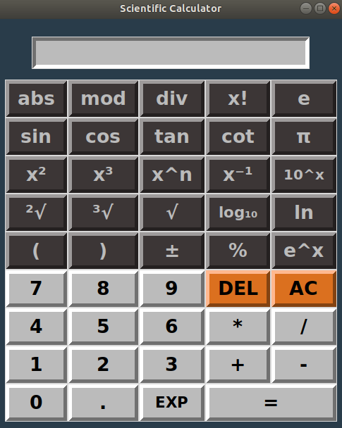

# Dice Roller

### Scientific Calculator with Tkinter Python GUI

   

#### Some explanations for each button and the function which represents are the following

- **1st Row**  
  
1. **abs** : The absolute value of a number (e.g. abs(-5) = 5)
2. **mod** : From *modulo* it's the operation to find the remainder of the division of one number by another.  
&nbsp; &nbsp; &nbsp; &nbsp; &nbsp; &nbsp;  In python we use the symbol %  (e.g. 5mod2 = 5%2 = 1)  
3. **div** : Floor division returns the result of the division rounded down to the nearest integer.  
&nbsp; &nbsp; &nbsp; &nbsp; &nbsp;  In python we use the symbol //  (e.g. 8div3 = 8//3 = 2)
4. **x!**  : The factorial of the number x (e.g. 4! = 24)
5. **e**   : The Euler's number. A mathematical constant approximately equal to 2.71828.  

- **2nd Row**  

1. **sin** : Sine of an angle &theta; in degrees (e.g. sin(90)=1)
2. **cos** : Cosine of an angle &theta; in degrees (e.g. cos(180)=-1)
3. **tan** : Tangent of an angle &theta; in degrees (e.g. tan(45)=1)
4. **cot** : Cotangent of an angle &theta; in degrees (e.g. cot(45) = 1/tan(45) = 1)
5. **π** : Archimedes' constant defined as the ratio of a circle's circumference to its diameter.  
&nbsp; &nbsp; &nbsp; &nbsp;It is approximately equal to 3.14159

- **3rd Row**  

1. **x^2** : x raised to the power of 2 (e.g. 4^2 = 16)
2. **x^3** : x raised to the power of 3 (e.g. 5^3 = 125)
3. **x^n** : x raised to any power (e.g. 2^4 = 16 )
4. **x^(-1)** : x raised to the power of (-1). The inverse of number x (e.g. 2^(-1) = 0.5)
5. **10^x** : Powers of 10 (e.g. 10^3 = 1000)

- **4th Row**  

1. 
2.
3.
4.
5.

- **5th Row**  

1.
2.
3.
4.
5.

## Author
* **Konstantinos Thanos**
